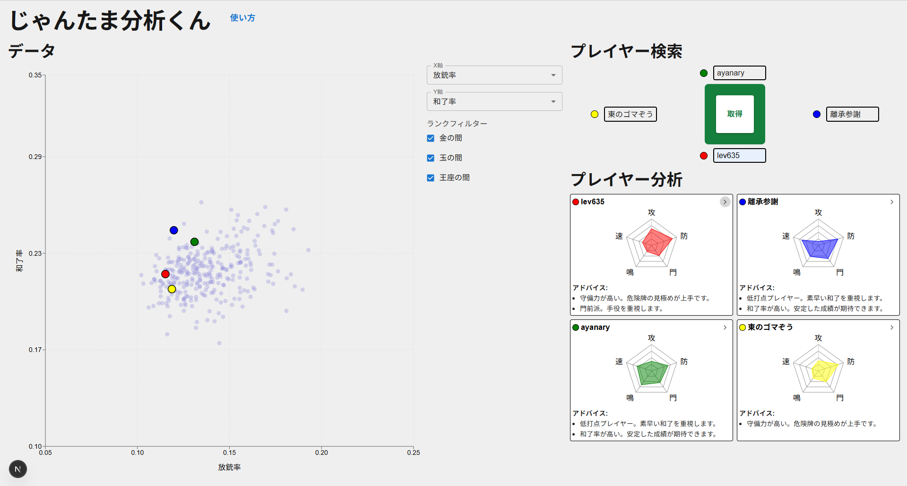

# じゃんたま分析くん
- [近未来体験2024](https://2024.eeic.jp/exhibition/) にて展示された『雀魂分析くんΩ』のリライト版です。
- データは[雀魂牌譜屋](https://amae-koromo.sapk.ch/)より取得しています。
- 自分や対戦相手の情報を取得し、プレースタイルを分かりやすく可視化します。

# 技術スタック

## フロントエンド
- **Next.js 15.5.4** - React フレームワーク
- **React 19.1.0** - UI ライブラリ
- **TypeScript 5** - 型安全な開発
- **Material-UI (MUI) v7.3.4** - UI コンポーネントライブラリ
- **Recharts 3.2.1** - データ可視化（散布図、レーダーチャート）

## バックエンド
- **Next.js API Routes** - サーバーサイド API
- **Puppeteer 24.23.0** - Webスクレイピング（プレイヤーデータ取得）
- **PapaParse 5.5.3** - CSV データ解析

# 使い方

## セットアップ
```bash
npm install
npm run dev
```

## 操作


### データエリア
- プレイヤーの統計情報を散布図で可視化します。
- 散布図の軸や表示するプレイヤーのランクを変更することができます。

### プレイヤー検索エリア
- 麻雀卓に見立てたテキストボックスにプレイヤー名を入力すると[雀魂牌譜屋](https://amae-koromo.sapk.ch/) から統計情報を取得します。
- 取得が完了すると散布図とプレイヤー分析エリアに可視化されます。
### プレイヤー分析エリア
- プレイヤーの打ち筋をレーダーチャートで評価します。
- 右上の矢印を押すとプレイヤーの統計情報を確認できます。


